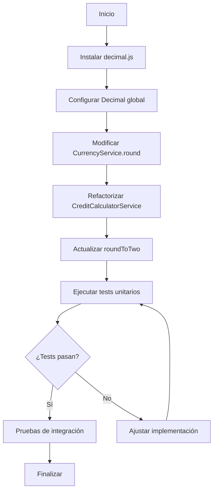

# Plan de integración de Decimal.js para redondeo en créditos

## Objetivo
Integrar la biblioteca `decimal.js` para manejar cálculos financieros con precisión arbitraria y redondeo consistente en la creación de créditos y otras operaciones monetarias.

## Análisis actual
### Servicios de redondeo
1. **CurrencyService.round**: Utiliza `Math.round` con factor decimal basado en la moneda (0, 2 decimales). 
2. **CreditCalculatorService**: Realiza cálculos de interés y cuotas usando aritmética de punto flotante nativa, luego aplica `CurrencyService.round`.
3. **CreditCalculatorService.roundToTwo**: Usa `toFixed(2)` y `parseFloat`.
4. **CajaService**: Utiliza `CurrencyService.round` para calcular el saldo final de caja.

### Problemas identificados
- Los cálculos con números de punto flotante pueden generar errores de redondeo (ej. 0.1 + 0.2 ≠ 0.3).
- `Math.round` puede comportarse inesperadamente con ciertos valores debido a la representación binaria.
- `toFixed` devuelve un string y `parseFloat` puede reintroducir errores.

## Estrategia de integración
1. **Instalar decimal.js** como dependencia de producción y `@types/decimal.js` para TypeScript.
2. **Configurar decimal.js** globalmente con precisión suficiente (ej. 20 dígitos) y modo de redondeo `ROUND_HALF_UP` (default).
3. **Modificar CurrencyService** para usar Decimal.js en su método `round`, manteniendo la misma firma pública.
4. **Extender CurrencyService** con métodos auxiliares para operaciones aritméticas (`multiply`, `divide`, `add`, `subtract`) que devuelvan números redondeados según la moneda (opcional).
5. **Refactorizar CreditCalculatorService** para usar Decimal.js en los cálculos de `calculateFromInterest` y `calculateFromCuota`, eliminando el uso de aritmética nativa.
6. **Reemplazar `roundToTwo`** por una implementación basada en Decimal.js.
7. **Actualizar cualquier otro uso** de `Math.round` o `toFixed` en el código base (si los hay).
8. **Asegurar la compatibilidad** con los tests existentes y agregar pruebas de precisión.

## Cambios detallados por archivo

### 1. package.json
```json
{
  "dependencies": {
    "decimal.js": "^10.4.3"
  },
  "devDependencies": {
    "@types/decimal.js": "^10.4.3"
  }
}
```

### 2. src/currency/currency.service.ts
- Importar `Decimal` desde `'decimal.js'`.
- Modificar método `round`:
```typescript
round(value: number, currencyCode: string): number {
  const config = this.getCurrencyConfig(currencyCode);
  const decimal = new Decimal(value);
  const rounded = decimal.toDecimalPlaces(config.decimalPlaces, Decimal.ROUND_HALF_UP);
  return rounded.toNumber();
}
```
- (Opcional) Agregar métodos auxiliares que acepten `Decimal` o `number`.

### 3. src/credito/helpers/credit.calculator.service.ts
- Importar `Decimal`.
- Refactorizar `calculateFromInterest`:
  - Convertir `valorCredito`, `interes` a Decimal.
  - Calcular `totalPagar = valorCredito * (1 + interes/100)` usando Decimal.
  - Calcular `valorCuota = totalPagar / totalCuotas`.
  - Usar `currencyService.round` para redondear cada resultado (pasar números).
- Refactorizar `calculateFromCuota` de manera similar.
- Reemplazar `roundToTwo`:
```typescript
private roundToTwo(value: number): number {
  return new Decimal(value).toDecimalPlaces(2, Decimal.ROUND_HALF_UP).toNumber();
}
```

### 4. src/caja/caja.service.ts
- No requiere cambios directos, ya que usa `currencyService.round` que será actualizado.

### 5. Otros archivos
- Revisar `src/credito/credito.service.ts` para cualquier cálculo manual (ej. división para mensajes) y considerar usar Decimal si es crítico.

## Pruebas
### Tests unitarios actualizados
- **CurrencyService.spec.ts**: Los tests existentes de `round` deben pasar sin modificaciones porque el comportamiento de redondeo half‑up se mantiene.
- **CreditCalculatorService.spec.ts**: Actualizar los tests para usar Decimal.js (los valores esperados pueden cambiar ligeramente debido a mayor precisión). Verificar que los resultados sean consistentes.
- **CajaService.spec.ts**: No deberían requerir cambios.

### Nuevos tests de precisión
- Agregar tests que comparen cálculos con decimal.js vs aritmética nativa para casos conocidos problemáticos (ej. 0.1 + 0.2).
- Verificar que el redondeo de montos grandes con muchos decimales sea correcto.
- Asegurar que las operaciones con distintas monedas (0, 2 decimales) produzcan resultados enteros o con exactamente los decimales configurados.

## Riesgos y consideraciones
1. **Rendimiento**: Decimal.js es más lento que las operaciones nativas, pero el impacto será negligible dado el volumen de operaciones (creación de créditos, cálculos puntuales).
2. **Compatibilidad con MongoDB**: Los valores almacenados seguirán siendo números de punto flotante; la precisión mejorará en los cálculos, pero la persistencia no cambiará.
3. **Mantenibilidad**: Introducir Decimal.js añade una nueva dependencia y requiere que los desarrolladores futuros conozcan su API.
4. **Errores de conversión**: `toNumber()` puede provocar pérdida de precisión en valores extremadamente grandes o con muchos decimales. Se debe documentar que los montos monetarios están limitados a los decimales de la moneda.

## Siguientes pasos
1. **Aprobación del plan** por parte del usuario.
2. **Cambiar a modo Code** para ejecutar la implementación.
3. **Instalar dependencias**.
4. **Implementar los cambios** siguiendo el orden descrito.
5. **Ejecutar tests** y ajustar según sea necesario.
6. **Realizar pruebas de integración** con datos reales.

## Diagrama de flujo (Mermaid)


---

*Este plan está sujeto a revisión y ajustes según feedback.*